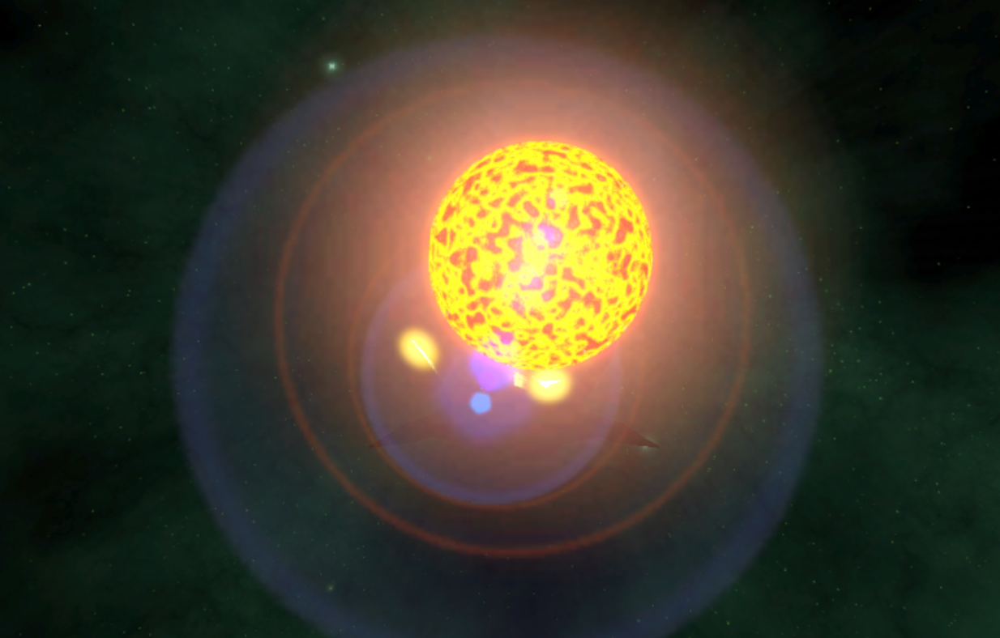

# GradientToTexture
A little Unity3d Editor script to create pngs out of a gradient. Usable for shaders.

If placed in an Assets/.../Editor folder,  you get an additional button under "Windows".

A little window shows up and you can create a fancy gradient of your liking. Once done you can set the width and then click the gen button
A file browser shows up, allowing you to pick the file destination.

This allows you to create gradient textures of your liking, for instance to use in shaders like the perlin noise:
http://scrawkblog.com/2013/05/18/gpu-gems-to-unity-improved-perlin-noise/

